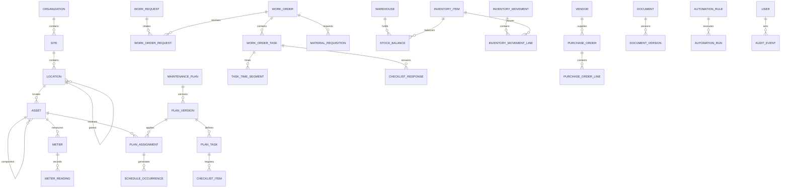

# Especificación funcional y técnica - CMMS propio

**Versión:** 1.0  
**Fecha:** 2026-08-14  
**Estado:** Base de producto lista para implementación incremental  
**Repositorio evaluado:** `flo19-coder/cmms` (rama `main`)  
**Fuente funcional estudiada:** manual de ayuda Fracttal One 2021, 309 páginas  
**Propósito:** definir un CMMS original inspirado en problemas y flujos habituales de mantenimiento, sin copiar código, textos, identidad visual, nombres comerciales ni componentes propietarios.

---

## 1. Cómo usar este documento

Este documento es el contrato de producto para Codex, desarrollo, pruebas y validación operativa. Cuando haya contradicción entre el código actual y esta especificación:

1. La seguridad y la integridad de datos tienen prioridad.
2. Las reglas y estados definidos aquí son el objetivo.
3. La migración debe preservar los datos existentes.
4. Los cambios incompatibles se implementan con migraciones y banderas de funcionalidad; nunca con borrado o reconstrucción silenciosa.
5. Cada historia debe terminar con pruebas, migración reversible cuando aplique y documentación breve.

Las referencias al manual señalan únicamente áreas funcionales analizadas. No autorizan a reproducir su interfaz, redacción, capturas o comportamiento exacto.

---

## 2. Límites legales y de diseño

### 2.1 Se puede reutilizar como conocimiento de dominio

- La idea general de gestionar activos, mantenimiento preventivo/correctivo, órdenes de trabajo, inventario, medidores, solicitudes, documentos y KPI.
- Flujos estándar de la industria: solicitud -> evaluación -> planificación -> ejecución -> revisión -> cierre.
- Conceptos operativos comunes como QR, jerarquía de ubicaciones, checklists, lecturas, stock mínimo, trazabilidad y permisos.
- Necesidades observadas en el manual, expresadas nuevamente con un modelo y una experiencia propios.

### 2.2 No se debe copiar

- Código fuente, respuestas de red, estructuras privadas de API, bases de datos o lógica obtenida por ingeniería inversa.
- Marca, logotipo, iconografía, paleta, tipografía, textos, ilustraciones, capturas, nombres distintivos o composición visual de Fracttal.
- HTML/CSS obtenido del producto, automatización del sitio, scraping autenticado o imitación pixel a pixel.
- Datos reales descargados de una cuenta ajena o mediante credenciales no autorizadas.

### 2.3 Principio de independencia

El CMMS debe funcionar completamente sin Fracttal y sin su API. Los conectores externos son adaptadores opcionales. El archivo actual `connectors/fracttal_client.py` no debe ser una dependencia del producto transaccional; se conservará únicamente como integración desactivada o se archivará cuando ya no tenga utilidad legítima.

---

## 3. Visión del producto

Crear un CMMS web, móvil y auditable para infraestructura clínica y planta física, usable también en otros sectores, que permita:

- conocer qué activos existen, dónde están y en qué condición se encuentran;
- recibir incidentes y convertirlos en trabajo controlado;
- programar mantenimiento por calendario, uso, lectura o evento;
- ejecutar trabajo desde celular con checklist, evidencias, tiempos y materiales;
- controlar repuestos, compras, entregas y devoluciones con un libro de movimientos;
- medir cumplimiento, disponibilidad, confiabilidad, costos y reincidencia;
- operar con permisos por sede, ubicación, equipo y asignación;
- mantener una bitácora verificable de cada cambio importante;
- importar datos sin depender de una API externa.

### 3.1 Objetivos medibles

- 100% de las OTs con autor, historial de estado y activo o ubicación responsable.
- 100% de los movimientos de inventario con documento origen y saldo resultante.
- Ninguna OT cerrada si faltan respuestas/evidencias obligatorias.
- Generación determinista e idempotente de mantenimientos programados.
- Búsqueda de un activo por código o QR en menos de 2 segundos para p95 con hasta 100.000 activos.
- Tablero operativo actualizado en menos de 60 segundos después de una transacción.
- Cero credenciales demo o secretos predeterminados en producción.

### 3.2 Fuera del alcance inicial

- Contabilidad general, nómina, facturación o ERP completo.
- Control clínico del paciente o historia clínica.
- SCADA/BMS en tiempo real de alta frecuencia.
- Gemelo digital 3D.
- Mercado público de planes de mantenimiento.

---

## 4. Diagnóstico del repositorio actual

### 4.1 Capacidades que ya existen y deben preservarse

- Aplicación Flask y PostgreSQL desplegable mediante `render.yaml`.
- Autenticación por sesión y cuatro roles base.
- Dashboard, listado y árbol de activos, ficha de activo, Kanban, calendario/Gantt y panel diario.
- Creación de OT, máquina de estados básica, historial de cambios y finalización transaccional.
- Checklists obligatorios y consumo de repuestos con control de stock.
- QR por activo, ficha pública y panel tipo kiosco.
- Auditoría, API JSON de lectura, pool de conexiones y endpoint de salud.
- ETL configurable, capas `staging/core/mart`, Airflow, datos sintéticos y pruebas automatizadas.

### 4.2 Brechas principales

| Área | Situación actual | Objetivo |
|---|---|---|
| Producto | Demo web más plataforma ETL | CMMS transaccional modular con ETL separado |
| Seguridad | API key global con valor por defecto; rutas QR públicas | credenciales sin valores por defecto, scopes, enlaces QR revocables y mínimo dato público |
| Datos | esquema `core` útil pero centrado en demo | dominios normalizados, migraciones Alembic y multi-sede desde el inicio |
| Activos | árbol y ficha ya presentes | ciclo de vida, estados, criticidad, componentes, documentos, costos y campos configurables |
| Planificación | tareas cargadas por ETL | planes versionados, activadores, calendario e instancia programada idempotente |
| OT | cinco estados simples | planificación, asignación, pausas, bloqueos, revisión, reapertura controlada y SLA |
| Solicitudes | no existe flujo completo | portal de solicitudes, triaje, duplicados, conversión y comunicación |
| Inventario | stock y consumo básico | libro inmutable, lotes, reservas, requisiciones, transferencias, compras y devoluciones |
| Medidores | lectura analítica | validación, calidad de dato, umbrales y disparo idempotente |
| Documentos | adjuntos locales | almacenamiento de objetos, versiones, vigencia y antivirus/validación |
| Permisos | roles jerárquicos fijos | RBAC por capacidad + alcance por sede/ubicación/asignación |
| Automatización | registro de eventos | reglas, outbox, reintentos, plantillas y trazabilidad de entregas |
| Calidad | buena base de pruebas unitarias | pruebas de integración, contratos API, permisos y concurrencia |

### 4.3 Decisión arquitectónica

No hacer una reescritura total. Convertir la aplicación en un **monolito modular** y extraer responsabilidades de forma incremental:

- `webapp/app.py` pasa a fábrica de aplicación y blueprints por dominio.
- La lógica de negocio vive en servicios; las rutas no escriben SQL directamente.
- PostgreSQL sigue siendo la fuente de verdad.
- Airflow queda para importaciones/analítica externas, no para transacciones ni generación de mantenimiento.
- La interfaz inicial puede seguir server-rendered con Jinja, HTMX y JavaScript liviano. Una SPA o app nativa solo se justifica después de estabilizar la API.

---

## 5. Modelo de usuarios, permisos y alcance

### 5.1 Roles predeterminados

Los roles son plantillas editables de permisos; no deben codificarse como una jerarquía rígida.

| Rol | Propósito |
|---|---|
| Administrador | configuración, seguridad, catálogos y acceso total controlado |
| Planificador | planes, calendario, asignaciones, cargas y reprogramaciones |
| Supervisor | aprobación, revisión técnica, priorización y análisis |
| Técnico | ejecución de OTs asignadas, tiempos, checklist, evidencias y lecturas |
| Solicitante/Operador | crear y consultar sus solicitudes; reportar lecturas autorizadas |
| Almacenista | existencias, recepción, entrega, devolución, conteos y transferencias |
| Compras | cotizaciones, órdenes de compra y proveedores |
| Auditor/Lector | lectura y exportación autorizada sin modificar datos |
| Integración | acceso API limitado a scopes y sedes explícitas; no inicia sesión humana |

### 5.2 Capacidades

Formato: `dominio.recurso.acción`. Acciones estándar: `view`, `create`, `update`, `delete`, `approve`, `assign`, `execute`, `close`, `export`, `admin`.

Capacidades mínimas:

- `assets.view/create/update/retire/export/qr`
- `people.view/manage`, `vendors.view/manage`
- `requests.view/create/triage/convert/cancel`
- `plans.view/manage/publish`
- `work_orders.view/create/plan/assign/execute/review/close/reopen/cancel/export`
- `meters.view/read/manage`
- `inventory.view/adjust/issue/receive/transfer/count`
- `purchasing.view/create/approve/receive`
- `documents.view/upload/manage`
- `automation.view/manage`
- `analytics.view/export`
- `users.manage`, `roles.manage`, `catalogs.manage`, `audit.view`

### 5.3 Matriz predeterminada

Leyenda: `T` total, `A` alcance autorizado, `P` propio/asignado, `-` denegado.

| Dominio/acción | Admin | Planificador | Supervisor | Técnico | Solicitante | Almacén | Compras | Auditor |
|---|:---:|:---:|:---:|:---:|:---:|:---:|:---:|:---:|
| Activos ver | T | A | A | A | A | A | A | A |
| Activos crear/editar | T | A | A | - | - | - | - | - |
| Activos retirar | T | - | A | - | - | - | - | - |
| Solicitudes crear | T | A | A | A | P | A | A | - |
| Solicitudes triaje/convertir | T | A | A | - | - | - | - | - |
| Planes crear/publicar | T | A | A | - | - | - | - | - |
| OTs crear/planificar | T | A | A | - | - | - | - | - |
| OTs asignar | T | A | A | - | - | - | - | - |
| OTs ejecutar | T | A | A | P | - | - | - | - |
| OTs revisar/cerrar | T | - | A | - | - | - | - | - |
| Medidores registrar lectura | T | A | A | A | A | - | - | - |
| Inventario ajustar/conteo | T | - | A | - | - | A | - | - |
| Inventario entregar/recibir | T | - | A | - | - | A | - | - |
| Compras crear | T | A | A | - | - | A | A | - |
| Compras aprobar | T | - | A | - | - | - | A* | - |
| Documentos subir | T | A | A | A | A* | A | A | - |
| Automatizaciones administrar | T | - | A | - | - | - | - | - |
| Analítica ver/exportar | T | A | A | P | P | A | A | A |
| Usuarios/roles administrar | T | - | - | - | - | - | - | - |
| Auditoría ver | T | - | A | - | - | - | - | A |

`*` sujeto a política específica. Una misma persona puede tener varios roles.

### 5.4 Alcance de datos

Cada concesión de rol incluye uno o varios alcances:

- organización completa;
- sede;
- rama de ubicación (nodo y descendientes);
- equipo de trabajo;
- solamente registros creados por el usuario;
- solamente OTs asignadas al usuario.

El alcance se valida en el servidor en cada consulta y mutación. Ocultar botones no es control de acceso.

### 5.5 Reglas de seguridad

- No existen contraseñas, secret keys o API keys predeterminadas en producción.
- Contraseñas con Argon2id o el algoritmo recomendado por la biblioteca vigente; MFA opcional en fase 2.
- Cookies `Secure`, `HttpOnly`, `SameSite=Lax`; protección CSRF en toda mutación web.
- API keys almacenadas por hash, con prefijo visible, scopes, expiración y revocación.
- Bloqueo progresivo/rate limit en login y recuperación.
- Los QR públicos contienen un token opaco revocable, no un código secuencial ni datos sensibles.
- Cada descarga comprueba permiso en el momento de servir el archivo.
- Toda aprobación, cierre, ajuste, cambio de permiso y exportación sensible queda auditada.

---

## 6. Arquitectura de información y navegación

### 6.1 Menú principal original

1. Inicio
2. Activos
3. Solicitudes
4. Trabajo
   - Planes
   - Programación
   - Órdenes de trabajo
5. Inventario
6. Monitoreo
7. Documentos
8. Automatizaciones
9. Analítica
10. Administración

### 6.2 Patrones transversales

- Buscador global por código, nombre, serial, OT, solicitud, proveedor y texto autorizado.
- Selector persistente de sede/ubicación y rango de fechas.
- Acción `Crear` contextual, no un menú que replique la marca o disposición de otro producto.
- Listas con filtros guardables, columnas configurables, paginación de servidor y exportación asíncrona.
- Panel lateral o página de detalle con historial, relaciones y acciones permitidas.
- Estados siempre acompañados por texto; el color nunca es el único indicador.
- Formularios con borrador, validación inmediata y aviso de cambios no guardados.
- Fechas almacenadas en UTC y mostradas en la zona horaria de la sede.
- Diseño responsive; ejecución de OT optimizada para una mano y conectividad irregular.

### 6.3 Catálogo de pantallas

| ID | Pantalla / ruta sugerida | Usuarios | Contenido y acciones principales |
|---|---|---|---|
| UI-NAV-01 | `/login` | humanos | inicio de sesión, recuperación, aviso de entorno |
| UI-NAV-02 | `/` | autenticados | indicadores por rol, pendientes y alertas accionables |
| UI-NAV-03 | `/search` | autenticados | resultados agrupados y filtrados por permisos |
| UI-AST-01 | `/assets/tree` | gestión/técnicos | árbol ubicación-activo, búsqueda, expansión y selección |
| UI-AST-02 | `/assets` | gestión | tabla, filtros, importación, exportación y acciones masivas |
| UI-AST-03 | `/assets/new` | autorizado | alta guiada de ubicación, activo fijo o activo digital |
| UI-AST-04 | `/assets/{id}` | autorizado | ficha, estado, jerarquía, OTs, lecturas, documentos, costos, repuestos |
| UI-AST-05 | `/assets/{id}/edit` | autorizado | edición con control de versión |
| UI-AST-06 | `/assets/qr` | autorizado | generación, revocación y plantillas propias de etiquetas |
| UI-PEO-01 | `/people` | gestión | personal, habilidades, calendario y costos |
| UI-PEO-02 | `/vendors` | gestión/compras | proveedores, contactos, servicios, documentos y desempeño |
| UI-REQ-01 | `/portal/request` | solicitantes | reporte corto, activo opcional, urgencia, foto y ubicación |
| UI-REQ-02 | `/requests` | gestión | bandeja, SLA, duplicados, prioridad y responsable de triaje |
| UI-REQ-03 | `/requests/{id}` | autorizado | conversación, adjuntos, historial, resolución o conversión |
| UI-PLN-01 | `/plans` | planificación | planes por estado, activo tipo y próxima activación |
| UI-PLN-02 | `/plans/{id}` | planificación | versiones, tareas, activadores, recursos y activos aplicados |
| UI-PLN-03 | `/plans/{id}/builder` | planificación | editor propio de tareas/checklists/recursos/activadores |
| UI-PLN-04 | `/schedule` | planificación | calendario, carga por técnico, backlog y reprogramación |
| UI-WO-01 | `/work-orders/board` | gestión/técnicos | tablero por estado y alcance, sin cambio inválido por arrastre |
| UI-WO-02 | `/work-orders/calendar` | gestión | vista temporal de trabajo y disponibilidad |
| UI-WO-03 | `/work-orders` | gestión | lista detallada, filtros, exportación y acciones masivas permitidas |
| UI-WO-04 | `/work-orders/new` | gestión | creación correctiva/preventiva/inspección/calibración/proyecto |
| UI-WO-05 | `/work-orders/{id}` | autorizado | cabecera, tareas, planificación, recursos, costos, historial y acciones |
| UI-WO-06 | `/work-orders/{id}/execute` | asignados | temporizador, checklist, evidencias, lecturas, materiales y firma |
| UI-WO-07 | `/work-orders/{id}/review` | supervisor | comparación plan-real, no conformidades, devolver o cerrar |
| UI-WO-08 | `/work-orders/{id}/print` | autorizado | informe PDF con plantilla propia y trazabilidad |
| UI-INV-01 | `/inventory/warehouses` | almacén | almacenes, valor, stock crítico y conteos abiertos |
| UI-INV-02 | `/inventory/items` | autorizado | catálogo de repuestos/herramientas/consumibles |
| UI-INV-03 | `/inventory/items/{id}` | autorizado | saldos por almacén, movimientos, proveedores y uso en activos |
| UI-INV-04 | `/inventory/movements/new` | almacén | recepción, entrega, devolución, transferencia y ajuste |
| UI-INV-05 | `/inventory/requisitions` | almacén/técnicos | reserva, entrega parcial/total, devolución y trazabilidad OT |
| UI-INV-06 | `/purchasing/orders` | compras | órdenes de compra, aprobación y recepción |
| UI-INV-07 | `/inventory/counts/{id}` | almacén | conteo ciego, diferencias, aprobación y contabilización |
| UI-MTR-01 | `/meters` | técnicos/gestión | medidores, calidad de dato, última lectura y alerta |
| UI-MTR-02 | `/meters/{id}` | autorizado | tendencia, lecturas, límites, activaciones y vínculos |
| UI-MTR-03 | `/meters/{id}/readings/new` | autorizado | lectura manual, evidencia, fecha y modo histórico |
| UI-DOC-01 | `/documents` | autorizado | biblioteca, carpetas lógicas, filtros y vencimientos |
| UI-DOC-02 | `/documents/{id}` | autorizado | versiones, relaciones, vigencia, descarga y auditoría |
| UI-AUT-01 | `/automations` | supervisor/admin | reglas activas, borradores, errores y última ejecución |
| UI-AUT-02 | `/automations/{id}` | supervisor/admin | evento, condiciones, acciones, prueba y registro |
| UI-ANA-01 | `/analytics/operations` | gestión | cumplimiento, backlog, SLA y carga |
| UI-ANA-02 | `/analytics/reliability` | gestión | disponibilidad, MTBF, MTTR y paradas |
| UI-ANA-03 | `/analytics/failures` | gestión | Pareto tipo-causa-activo y reincidencia |
| UI-ANA-04 | `/analytics/inventory` | almacén/compras | rotación, quiebres, exactitud, consumo y valor |
| UI-ADM-01 | `/admin/organization` | admin | empresa, sedes, moneda, idioma y zona horaria |
| UI-ADM-02 | `/admin/calendars` | admin/planificador | turnos, días laborables y festivos |
| UI-ADM-03 | `/admin/users` | admin | usuarios, estado, roles, scopes, MFA y sesiones |
| UI-ADM-04 | `/admin/roles` | admin | matriz de capacidades y alcances |
| UI-ADM-05 | `/admin/catalogs` | admin | prioridades, fallas, unidades, tipos y centros de costo |
| UI-ADM-06 | `/admin/imports` | admin/planificador | asistente de mapeo, validación, ejecución y rollback controlado |
| UI-ADM-07 | `/admin/audit` | admin/auditor | bitácora filtrable, antes/después y exportación autorizada |

---

## 7. Especificación funcional por módulo

### 7.1 Inicio, búsqueda e intercambio de datos

**Requisitos**

- `GEN-01` El inicio muestra tarjetas diferentes según rol y alcance.
- `GEN-02` Todos los indicadores aceptan sede/ubicación y rango de fechas y muestran cuándo fueron actualizados.
- `GEN-03` La búsqueda global nunca revela la existencia de un registro fuera del alcance del usuario.
- `GEN-04` Las exportaciones grandes se ejecutan como trabajo asíncrono y generan un archivo con expiración.
- `GEN-05` La importación se realiza en cinco pasos: archivo -> hoja -> mapeo -> validación previa -> confirmación.
- `GEN-06` Cada fila importada conserva `import_job_id`, resultado y número de fila de origen.
- `GEN-07` Un rollback de importación solo elimina registros creados por ese trabajo que no tengan dependencias posteriores; los demás se reportan para resolución manual.
- `GEN-08` La importación jerárquica resuelve padres en cualquier orden mediante dos pasadas; no obliga a ordenar Excel.
- `GEN-09` Las claves naturales duplicadas se rechazan o actualizan únicamente si el usuario eligió explícitamente `upsert`.
- `GEN-10` Se admite CSV y XLSX sin fórmulas ejecutables; se normalizan espacios, fechas y codificación.

**Indicadores del inicio**

- OTs por estado, vencidas y bloqueadas.
- Trabajo preventivo vs correctivo.
- Cumplimiento programado, backlog por antigüedad y SLA de solicitudes.
- Activos fuera de servicio y horas de parada.
- Stock bajo, requisiciones pendientes y compras retrasadas.
- Documentos/garantías próximos a vencer.
- Alertas de medidores y automatizaciones fallidas.

### 7.2 Activos, ubicaciones y ciclo de vida

Áreas del manual analizadas: jerarquía, tipos de activo, ficha, QR, campos adicionales, relaciones, historial, documentos e importación (pp. 24-67).

**Decisión de modelado original:** las ubicaciones, los activos mantenibles y los artículos de inventario son entidades separadas. La interfaz puede mostrarlos en un árbol unificado, pero un repuesto no se trata como edificio ni un edificio como saldo de almacén.

**Requisitos**

- `AST-01` Cada ubicación y activo tiene UUID interno y código único por organización.
- `AST-02` Una ubicación puede contener ubicaciones y activos; un activo puede tener componentes activos mediante `parent_asset_id`.
- `AST-03` No se permiten ciclos en ninguna jerarquía.
- `AST-04` Un activo registra nombre, tipo, fabricante, modelo, serial, criticidad, centro de costo, responsable, fechas de compra/instalación, costo, vida útil, horas esperadas y notas.
- `AST-05` Estados de ciclo de vida: `DRAFT`, `ACTIVE`, `OUT_OF_SERVICE`, `IN_STORAGE`, `RETIRED`, `DISPOSED`.
- `AST-06` `OUT_OF_SERVICE` exige fecha, causa y origen; al volver a servicio se cierra el periodo de indisponibilidad.
- `AST-07` Retirar un activo no borra su historia y bloquea nuevas programaciones salvo autorización.
- `AST-08` Los campos configurables se definen por tipo de activo, con tipo de dato, unidad, obligatoriedad, validación y versión.
- `AST-09` Se soportan relaciones activo-proveedor, activo-repuesto compatible, activo-documento y activo-medidor.
- `AST-10` El QR abre una vista mínima configurable; las acciones requieren autenticación o un token de tarea de corto alcance.
- `AST-11` Clonar un activo copia campos seleccionados, nunca código, serial, QR, lecturas, historial ni documentos privados.
- `AST-12` Mover un activo de ubicación registra origen, destino, fecha, actor y motivo.
- `AST-13` La ficha ofrece una línea temporal consolidada de OTs, solicitudes, paradas, lecturas y movimientos.
- `AST-14` Se puede marcar un activo como crítico y exigir aprobación para retirada o cambio de ubicación.

### 7.3 Personas, competencias y terceros

Áreas analizadas: recursos humanos, terceros, contactos, servicios, asignaciones y restricciones (pp. 68-83).

- `PEO-01` La persona operativa y la cuenta de acceso son entidades distintas y vinculables.
- `PEO-02` Una persona tiene código, contacto, sede, equipo, cargo, tarifa, calendario, habilidades, certificaciones y estado.
- `PEO-03` Las certificaciones pueden vencer y bloquear asignaciones que requieran esa competencia.
- `PEO-04` Un proveedor puede actuar como fabricante, prestador de servicio o proveedor de material sin registros duplicados.
- `PEO-05` Se registran sedes/contactos, servicios y tarifas del proveedor.
- `PEO-06` Desactivar persona/proveedor impide nuevas asignaciones, pero preserva toda referencia histórica.
- `PEO-07` Las herramientas entregadas a una persona se controlan mediante movimientos, no un campo editable.
- `PEO-08` El desempeño del proveedor se calcula por plazo, calidad y reclamaciones, sin permitir editar el resultado histórico.

### 7.4 Solicitudes de trabajo

Áreas analizadas: alta, estados, información de incidente y conversión a trabajo (pp. 250-266).

- `REQ-01` Un solicitante puede reportar con descripción, activo conocido u ubicación, fecha del incidente, urgencia, observaciones, fotos y GPS opcional.
- `REQ-02` El sistema asigna folio legible e inicia SLA según prioridad y calendario.
- `REQ-03` Triaje permite validar activo, clasificar, priorizar, fusionar duplicados, pedir información, rechazar, resolver sin OT o convertir.
- `REQ-04` Convertir crea una OT o una tarea programable y mantiene relación bidireccional.
- `REQ-05` El solicitante ve estado, comentarios públicos y resolución, pero no costos ni notas internas.
- `REQ-06` Los comentarios distinguen `PUBLIC` e `INTERNAL`.
- `REQ-07` Resolver sin OT exige categoría y explicación; rechazar exige motivo.
- `REQ-08` Una solicitud convertida refleja el estado derivado de la OT sin perder su propio historial.
- `REQ-09` Reabrir una solicitud resuelta requiere permiso y razón; no reabre automáticamente una OT cerrada.
- `REQ-10` Las solicitudes urgentes notifican al grupo de guardia, pero no saltan las validaciones de seguridad.

### 7.5 Planes, tareas y programación preventiva

Áreas analizadas: planes, tareas, checklists, iteraciones, recursos y activadores (pp. 113-141).

- `PLN-01` Un plan es una plantilla versionada con estado `DRAFT`, `PUBLISHED`, `SUPERSEDED`, `ARCHIVED`.
- `PLN-02` Publicar congela la versión; editar crea una nueva versión sin alterar OTs existentes.
- `PLN-03` Un activo puede tener varios planes aplicables. Se evita la limitación de un solo plan por activo.
- `PLN-04` Una tarea plantilla define tipo, prioridad, duración, parada prevista, competencias, recursos, instrucciones y checklist.
- `PLN-05` Tipos de respuesta de checklist: texto, sí/no/NA, número con unidad y rango, selección, verificación, lectura de medidor, foto/archivo, firma y GPS.
- `PLN-06` Un ítem puede exigir respuesta, evidencia y comentario condicional.
- `PLN-07` Activadores: calendario, contador acumulado, umbral/condición, evento de dominio y manual.
- `PLN-08` El calendario soporta frecuencia fija y frecuencia desde última ejecución, zona horaria, horario laboral y festivos.
- `PLN-09` La programación fija conserva el ancla aunque el trabajo se complete tarde; la dinámica parte de la fecha/lectura real aprobada.
- `PLN-10` Los activadores acumulados no aceptan lecturas regresivas salvo corrección autorizada.
- `PLN-11` Los activadores de condición soportan operadores, histéresis, duración mínima y periodo de enfriamiento para evitar OTs repetidas.
- `PLN-12` Las tareas cíclicas pueden usar una secuencia de paquetes (A/B/C o iteraciones) y recursos diferentes por ciclo.
- `PLN-13` Al asignar un plan a un activo se define ancla, medidores, próxima activación y excepciones particulares.
- `PLN-14` El generador crea como máximo una instancia por `plan_assignment + task + due_anchor`; una restricción única garantiza idempotencia.
- `PLN-15` Reprogramar exige fecha, razón, actor y conserva la fecha original para medir cumplimiento.
- `PLN-16` Cancelar una ocurrencia no modifica automáticamente la plantilla ni las siguientes ocurrencias.
- `PLN-17` Los planes se pueden exportar/importar en un formato JSON propio versionado, firmado con checksum y sin códigos propietarios.

### 7.6 Órdenes de trabajo y ejecución

Áreas analizadas: vistas, OT planificada/no planificada, ejecución, pausas, recursos, revisión, firmas y presupuestos (pp. 142-191).

- `WO-01` Orígenes: plan, solicitud, medidor, inspección, correctivo manual, proyecto e integración.
- `WO-02` Tipos configurables iniciales: preventivo, correctivo, inspección, calibración, mejora y emergencia.
- `WO-03` Una OT contiene una o más tareas; cada tarea conserva tiempos, checklist, recursos y resultado propios.
- `WO-04` Crear OT exige activo o ubicación, descripción, prioridad y origen; activo opcional solo para trabajo de área autorizado.
- `WO-05` Planificar define ventana, fecha objetivo, responsables, competencias, duración, parada, materiales previstos y dependencias.
- `WO-06` Asignar verifica alcance, disponibilidad y competencias obligatorias.
- `WO-07` Iniciar una tarea abre un segmento de tiempo; pausar lo cierra con motivo; reanudar crea otro segmento.
- `WO-08` Nunca se deriva el trabajo real únicamente de `inicio-fin`; se suman segmentos efectivos.
- `WO-09` Material solicitado genera reserva/requisición; material entregado y material usado se registran por separado.
- `WO-10` El técnico puede devolver sobrantes; el stock cambia solo mediante movimientos contabilizados.
- `WO-11` El checklist obligatorio, las evidencias, la firma y las lecturas requeridas son guardas de transición.
- `WO-12` Enviar a revisión exige todas las tareas completadas o anuladas con motivo.
- `WO-13` La revisión puede aprobar/cerrar o devolver a ejecución con una no conformidad y comentario obligatorio.
- `WO-14` Cerrar fija una instantánea de costos, recalcula próxima programación cuando corresponda y emite eventos de dominio.
- `WO-15` Una OT cerrada no se edita. Una corrección se realiza mediante reapertura controlada o asiento compensatorio, siempre auditado.
- `WO-16` Cancelar exige motivo y libera reservas; no revierte consumos contabilizados sin un movimiento de devolución.
- `WO-17` OTs relacionadas soportan padre/hija, duplicado, seguimiento y causa común.
- `WO-18` Los costos separan mano de obra, material, servicio y otros; se conservan moneda y tasa usada.
- `WO-19` Si se requiere presupuesto, la OT no pasa a ejecución hasta aprobación; el presupuesto aprobado no altera recursos sin una acción explícita.
- `WO-20` La impresión es una representación, no la fuente de verdad; muestra ID, revisión, firmas, tiempos, tareas, materiales y auditoría esencial.

### 7.7 Inventario, requisiciones y compras

Áreas analizadas: almacenes, existencias, ajustes, entradas, salidas, requisiciones y órdenes de compra (pp. 85-112).

- `INV-01` Cada almacén tiene código, sede, moneda y alcance; los correlativos son configurables pero únicos.
- `INV-02` El saldo no se edita directamente: es la suma de movimientos contabilizados.
- `INV-03` Tipos de artículo: repuesto, consumible, herramienta y servicio no almacenable.
- `INV-04` Se controla saldo disponible, reservado, en tránsito y físico por almacén/ubicación interna.
- `INV-05` Todo movimiento tiene cabecera, líneas, motivo, documento origen, actor, fecha y estado borrador/contabilizado/anulado.
- `INV-06` Contabilizar es transaccional e inmutable; corregir genera reverso y nuevo asiento.
- `INV-07` No se permite saldo negativo salvo política explícita por almacén y permiso especial.
- `INV-08` Valoración inicial recomendada: costo promedio móvil por almacén; cada movimiento guarda costo unitario y total.
- `INV-09` Inventario inicial se realiza como trabajo de importación aprobado, no como excepción irrepetible oculta.
- `INV-10` Conteo físico puede ser ciego; las diferencias requieren aprobación antes del ajuste.
- `INV-11` Una requisición nace de una OT o de una solicitud general, admite reserva y entregas parciales.
- `INV-12` La entrega se registra contra destinatario y OT; el consumo real y la devolución cierran la trazabilidad.
- `INV-13` Transferir crea salida y entrada enlazadas; estados `IN_TRANSIT` y `RECEIVED` evitan stock fantasma.
- `INV-14` Herramientas asignadas conservan custodio, condición, fecha esperada y devolución.
- `INV-15` Stock mínimo/máximo y punto de reorden generan alertas idempotentes, no compras automáticas sin autorización.
- `INV-16` La orden de compra contiene proveedor, moneda, impuestos, centro de costo, entrega prevista y líneas.
- `INV-17` Estados de compra y recepción parcial están separados; recibir actualiza inventario y costo en una sola transacción.
- `INV-18` Devolución a proveedor referencia la recepción original.

### 7.8 Medidores y condición

Áreas analizadas: medidores acumulados/no acumulados, lecturas y activadores (pp. 192-201).

- `MTR-01` Un medidor pertenece a un activo y define unidad, clase, precisión, fuente y reglas de calidad.
- `MTR-02` Clases: acumulador monotónico, instantáneo y calculado.
- `MTR-03` Cada lectura guarda instante medido, instante recibido, valor, fuente, usuario/dispositivo y calidad.
- `MTR-04` Una lectura histórica puede excluirse de activadores, pero se conserva y audita.
- `MTR-05` Corregir una lectura crea una nueva versión o marca la anterior como sustituida; no se borra silenciosamente.
- `MTR-06` Los acumuladores rechazan regresiones salvo cambio/reinicio de medidor documentado.
- `MTR-07` Valores fuera de rango técnico se marcan sospechosos y no disparan trabajo hasta validación según política.
- `MTR-08` Un evento de lectura se procesa una sola vez por cada regla/umbral.
- `MTR-09` El gráfico distingue dato válido, sospechoso, corregido y faltante.
- `MTR-10` Importaciones y dispositivos usan idempotency key para evitar lecturas duplicadas.

### 7.9 Documentos y archivos

Áreas analizadas: biblioteca, adjuntos, garantías, vigencia y relaciones (pp. 242-249 y 302-307).

- `DOC-01` Los archivos binarios se guardan en almacenamiento de objetos; PostgreSQL conserva metadatos y relaciones.
- `DOC-02` Un documento tiene categoría, versión, checksum, autor, vigencia, confidencialidad y estado.
- `DOC-03` Puede relacionarse con activos, personas, proveedores, planes, OTs y solicitudes.
- `DOC-04` Nueva versión no reemplaza el binario histórico.
- `DOC-05` Vencimientos generan eventos y notificaciones configurables.
- `DOC-06` Se validan tamaño, tipo real, extensión y nombre; se recomienda análisis antimalware antes de publicar.
- `DOC-07` El nombre de carpeta es organización lógica, no una ruta confiable suministrada al sistema de archivos.
- `DOC-08` Borrar normalmente archiva; la eliminación física obedece retención y autorización.

### 7.10 Automatización y notificaciones

Áreas analizadas: evento-condición-acción, grupos y activación de reglas (pp. 202-215).

- `AUT-01` Una regla versionada contiene evento, condiciones, acciones, prioridad, estado y alcance.
- `AUT-02` Eventos iniciales: OT creada/asignada/vencida/devuelta/cerrada; solicitud urgente/cambio de estado; stock bajo; documento próximo a vencer; lectura en alarma; compra retrasada.
- `AUT-03` Condiciones se expresan con un DSL JSON limitado y validado; no se ejecuta código arbitrario.
- `AUT-04` Acciones iniciales: correo, notificación interna, webhook firmado, crear tarea/OT, actualizar prioridad y generar alerta.
- `AUT-05` Crear OT por regla requiere clave de deduplicación y ventana de enfriamiento.
- `AUT-06` El patrón outbox garantiza que el evento se guarde en la misma transacción que el cambio de negocio.
- `AUT-07` Entregas usan reintento exponencial, límite, cola de errores y reejecución autorizada.
- `AUT-08` Se registra entrada, regla/version, resultado, intentos y error depurado sin secretos.
- `AUT-09` Las plantillas de mensaje son propias, localizadas y escapan contenido del usuario.
- `AUT-10` Un modo de prueba evalúa sobre un evento de muestra sin ejecutar acciones reales.

### 7.11 Analítica y KPI

Áreas analizadas: cumplimiento, tareas, fallas, OTs, solicitudes, disponibilidad, MTBF y MTTR (pp. 216-241).

- `ANA-01` Cada indicador muestra fórmula, filtros, zona horaria, fecha de actualización y población incluida.
- `ANA-02` Programado, creado, ejecutado y cerrado son fechas distintas y no se mezclan.
- `ANA-03` Cumplimiento preventivo = tareas preventivas cerradas dentro de tolerancia / tareas preventivas exigibles en el periodo.
- `ANA-04` Backlog se expresa en cantidad, horas estimadas y antigüedad.
- `ANA-05` MTTR usa eventos de falla reparados y tiempo restauración-inicio de falla; excluir esperas debe ser una métrica separada.
- `ANA-06` MTBF usa tiempo operativo entre fallas funcionales del mismo activo y exige al menos dos fallas válidas.
- `ANA-07` Disponibilidad = tiempo requerido - indisponibilidad / tiempo requerido, con calendarios y periodos de parada explícitos.
- `ANA-08` Pareto permite profundizar tipo -> causa -> activo -> OT.
- `ANA-09` Solicitudes incluyen volumen, SLA de primera respuesta, resolución, reapertura y calificación.
- `ANA-10` Inventario incluye exactitud de conteo, rotación, quiebres, obsolescencia, consumo por activo y cumplimiento de proveedor.
- `ANA-11` Los totales de una gráfica enlazan a una lista filtrada reproducible.
- `ANA-12` La capa analítica puede usar vistas/materialized views, pero la aplicación transaccional nunca escribe en ellas.

### 7.12 Administración y auditoría

Áreas analizadas: empresa, calendario, usuarios, permisos, financiero, catálogos y log (pp. 267-309).

- `ADM-01` Configuración por organización: nombre, logo propio, idioma, moneda, zona horaria y formatos.
- `ADM-02` Cada sede puede tener calendario, turnos, días laborales y festivos recurrentes.
- `ADM-03` Si una fecha preventiva cae fuera del calendario, la política define mover antes, mover después o conservar con advertencia.
- `ADM-04` Catálogos son registros versionables/desactivables; no se borran si tienen uso histórico.
- `ADM-05` Monedas usan ISO 4217; tipos de cambio conservan fecha y fuente.
- `ADM-06` Secuencias de folios son atómicas y separadas por organización/documento/año cuando se configure.
- `ADM-07` Auditoría guarda actor humano o integración, acción, entidad, ID, fecha, IP, request ID y diferencias antes/después saneadas.
- `ADM-08` La auditoría es append-only para usuarios normales; su retención se configura y exporta con control.
- `ADM-09` Acciones masivas informan alcance exacto y exigen confirmación reforzada cuando son irreversibles.
- `ADM-10` La configuración sensible nunca se incluye completa en logs ni respuestas.

---

## 8. Máquinas de estados

Los estados se almacenan como códigos estables en inglés y se traducen en la interfaz. Toda transición pasa por un servicio de dominio que valida permiso, estado esperado y guardas. Cada cambio escribe historial y evento outbox en la misma transacción.

### 8.1 Solicitud

| Estado | Significado | Transiciones permitidas |
|---|---|---|
| `DRAFT` | borrador del solicitante | `SUBMITTED`, `CANCELLED` |
| `SUBMITTED` | recibida, sin triaje | `NEEDS_INFO`, `TRIAGED`, `REJECTED`, `CANCELLED` |
| `NEEDS_INFO` | espera información del solicitante | `SUBMITTED`, `CANCELLED` |
| `TRIAGED` | clasificada y priorizada | `SCHEDULED`, `CONVERTED`, `RESOLVED_NO_WO`, `REJECTED` |
| `SCHEDULED` | convertida en tarea pendiente | `CONVERTED`, `RESOLVED_NO_WO`, `CANCELLED` |
| `CONVERTED` | vinculada a una o más OTs | estado derivado visible; no transición manual normal |
| `RESOLVED_NO_WO` | resuelta sin OT | `REOPENED` |
| `RESOLVED_WITH_WO` | todas las OTs vinculadas cerraron con resolución | `REOPENED` |
| `REJECTED` | no corresponde o duplicada | `REOPENED` |
| `CANCELLED` | retirada por solicitante/gestión | terminal salvo reapertura autorizada |
| `REOPENED` | resolución cuestionada | `TRIAGED`, `CONVERTED`, `RESOLVED_NO_WO` |

Reglas derivadas:

- Si alguna OT vinculada está activa, la solicitud muestra `Trabajo en curso`.
- Solo se marca `RESOLVED_WITH_WO` cuando todas las OTs resolutivas están cerradas; una OT cancelada no cuenta como resolución.
- Fusionar duplicados enlaza la solicitud secundaria con la principal y conserva ambos folios.

### 8.2 Orden de trabajo

| Estado | Entrada válida | Salidas | Guardas principales |
|---|---|---|---|
| `DRAFT` | creación manual/importación | `PENDING_APPROVAL`, `PLANNED`, `CANCELLED` | datos mínimos válidos |
| `PENDING_APPROVAL` | costo, riesgo o política | `PLANNED`, `REJECTED`, `CANCELLED` | aprobador distinto cuando aplique |
| `REJECTED` | aprobación rechazada | `DRAFT`, `CANCELLED` | motivo obligatorio |
| `PLANNED` | trabajo definido | `SCHEDULED`, `CANCELLED` | tareas y ventana válidas |
| `SCHEDULED` | fecha y recursos asignados | `ASSIGNED`, `PLANNED`, `CANCELLED` | calendario y dependencias |
| `ASSIGNED` | responsable aceptable | `IN_PROGRESS`, `SCHEDULED`, `CANCELLED` | competencia y permiso |
| `IN_PROGRESS` | ejecución iniciada | `PAUSED`, `WAITING_PARTS`, `WAITING_VENDOR`, `QUALITY_REVIEW`, `CANCELLED` | temporizador/checklist consistentes |
| `PAUSED` | pausa operativa | `IN_PROGRESS`, `CANCELLED` | razón obligatoria |
| `WAITING_PARTS` | falta material | `IN_PROGRESS`, `CANCELLED` | requisición o nota |
| `WAITING_VENDOR` | espera tercero | `IN_PROGRESS`, `CANCELLED` | proveedor/fecha prevista |
| `QUALITY_REVIEW` | trabajo enviado a revisión | `COMPLETED`, `IN_PROGRESS` | tareas terminadas y evidencias |
| `COMPLETED` | cierre aprobado | `REOPENED` | permiso especial y razón |
| `REOPENED` | corrección posterior | `IN_PROGRESS`, `QUALITY_REVIEW`, `COMPLETED` | incidente de reapertura |
| `CANCELLED` | trabajo cancelado | terminal | motivo y liberación de reservas |

Notas:

- `OVERDUE` no es estado: es una condición calculada para cualquier OT abierta cuya fecha objetivo venció.
- El porcentaje de avance se calcula por tareas ponderadas; no se asigna artificialmente por estado.
- El flujo de emergencia puede crear y asignar en una sola operación, pero registra las transiciones lógicas y no omite guardas de cierre.
- Una OT `COMPLETED` es inmutable salvo reapertura; toda reapertura conserva la versión del cierre anterior.

### 8.3 Tarea dentro de OT

`PENDING -> IN_PROGRESS <-> PAUSED -> DONE`  
Salidas excepcionales: `SKIPPED` con razón y permiso, `FAILED` con hallazgo/no conformidad.

### 8.4 Presupuesto

`DRAFT -> SUBMITTED -> APPROVED | REJECTED | EXPIRED | CANCELLED`  
Editar un presupuesto enviado crea revisión nueva. Aprobar exige límite monetario suficiente y conserva moneda/tasa.

### 8.5 Requisición de material

`DRAFT -> REQUESTED -> RESERVED -> PARTIALLY_ISSUED -> FULLY_ISSUED -> CLOSED`  
Ramas: `REQUESTED/RESERVED/PARTIALLY_ISSUED -> CANCELLED`. Una devolución puede ocurrir después de entrega y antes o después de cierre mediante movimiento relacionado.

### 8.6 Orden de compra

`DRAFT -> SUBMITTED -> APPROVED -> ORDERED -> PARTIALLY_RECEIVED -> RECEIVED -> CLOSED`  
Ramas: `SUBMITTED -> REJECTED`; estados no cerrados -> `CANCELLED` si no contradice recepciones existentes.

### 8.7 Documento

`DRAFT -> ACTIVE -> EXPIRED | SUPERSEDED | ARCHIVED`. Una versión nueva lleva la anterior a `SUPERSEDED` cuando se publica.

### 8.8 Importación

`UPLOADED -> MAPPED -> VALIDATED -> CONFIRMED -> PROCESSING -> COMPLETED | COMPLETED_WITH_ERRORS | FAILED`  
Opcional: `COMPLETED* -> ROLLBACK_PENDING -> ROLLED_BACK | ROLLBACK_PARTIAL`.

---

## 9. Flujos de extremo a extremo

### F-01: incidente hasta cierre

1. Operador crea solicitud y adjunta foto.
2. Sistema asigna folio, SLA y notifica triaje.
3. Planificador valida sede/activo, prioridad, falla probable y duplicados.
4. Convierte la solicitud en OT correctiva conservando el vínculo.
5. Planifica responsables, ventana, parada y materiales previstos.
6. Almacén reserva/entrega materiales si existen.
7. Técnico inicia, completa checklist, registra tiempos, lecturas, fotos y materiales usados.
8. Técnico envía a revisión.
9. Supervisor devuelve con no conformidad o aprueba el cierre.
10. Cierre actualiza parada, costos, estado del activo, solicitud, analítica y notificaciones.

**Excepciones:** activo desconocido, emergencia, falta de repuesto, proveedor externo, resolución sin OT, reapertura.

### F-02: preventivo por calendario

1. Planificador publica versión de plan.
2. Asigna plan/versión al activo y define ancla y calendario.
3. Generador toma advisory lock, calcula ventana y crea una ocurrencia idempotente.
4. Ocurrencia entra al backlog y luego se agrupa o convierte en OT según política.
5. Reprogramar conserva fecha original y razón.
6. Al cerrar, la próxima fecha sigue ancla fija o fecha real según configuración.

### F-03: mantenimiento por contador

1. Se registra lectura válida de medidor acumulado.
2. Motor evalúa umbrales pendientes en orden.
3. Por cada umbral cruzado crea evento con clave única.
4. Genera ocurrencia/OT una sola vez, aunque la lectura se reprocese.
5. Si el medidor fue reemplazado, el evento de reinicio crea una nueva serie sin alterar el histórico.

### F-04: condición fuera de rango

1. Lectura instantánea llega con unidad y calidad.
2. Se normaliza unidad y valida rango físico.
3. Regla aplica histéresis y duración mínima.
4. Al confirmarse condición, emite alerta/solicitud/OT según política.
5. El periodo de enfriamiento evita duplicados; la recuperación genera evento separado.

### F-05: material para OT

1. Planificador/técnico solicita artículo y cantidad.
2. Almacén reserva total o parcial.
3. Almacenista entrega; se registra salida y custodio/OT.
4. Técnico declara usado y sobrante.
5. Sobrante vuelve mediante devolución; diferencia requiere explicación.
6. Cierre de OT muestra costo real y trazabilidad completa.

### F-06: reposición y compra

1. Stock disponible cruza punto de reorden.
2. Regla crea alerta o propuesta, deduplicada por artículo/almacén.
3. Compras consolida requerimientos y crea OC.
4. Aprobador valida monto/centro de costo.
5. Recepción parcial genera entrada, costo promedio, lote si aplica y saldo en tránsito restante.
6. Recepción final cierra OC; devoluciones referencian recepción.

### F-07: importación inicial sin API externa

1. Usuario descarga plantilla propia o sube su CSV/XLSX.
2. Asistente detecta encabezados y permite mapearlos.
3. Validación previa reporta códigos repetidos, padres inexistentes, unidades inválidas y referencias faltantes.
4. Usuario corrige archivo o acepta solo filas válidas según política.
5. Procesamiento en lote usa transacciones acotadas e idempotency key.
6. Se entrega resumen y archivo de errores con fila/campo/mensaje.
7. Los registros conservan linaje; rollback es seguro y explícito.

### F-08: documento o garantía por vencer

1. Usuario publica documento y lo vincula.
2. Trabajo programado detecta la ventana de aviso.
3. Outbox genera notificación a responsable.
4. Renovar crea versión nueva; la anterior conserva evidencia histórica.

### F-09: acceso por QR

1. Usuario escanea un token opaco.
2. Vista pública, si está habilitada, solo muestra nombre seguro, ubicación general, condición y botón de reportar.
3. Para ver historial, ejecutar o registrar datos se solicita sesión.
4. Revocar/reemitir el QR invalida el token anterior sin cambiar el código del activo.

---

## 10. Modelo de datos propuesto

### 10.1 Convenciones

- PostgreSQL 16 o compatible.
- UUID v7 para PK de dominio; folios humanos separados.
- Todas las tablas de negocio incluyen `organization_id`, `created_at`, `created_by`, `updated_at`, `version`.
- `timestamp with time zone`; importes `numeric(19,4)`; cantidades `numeric(18,6)`.
- Códigos normalizados y únicos mediante índice por organización, sin distinguir mayúsculas cuando el negocio lo requiera.
- Borrado lógico solo donde tenga sentido. Transacciones, auditoría y movimientos no se borran.
- Estados con `CHECK` o tabla de transición controlada; no texto libre.
- FK explícitas, índices en FK, fechas de consulta y claves naturales.
- Control optimista mediante `version`; mutaciones críticas verifican estado esperado.

### 10.2 Diagrama conceptual



### 10.3 Esquemas y tablas

#### `iam` - identidad y acceso

| Tabla | Columnas esenciales / reglas |
|---|---|
| `organization` | `id`, `code`, `name`, `default_currency`, `default_timezone`, `status` |
| `site` | `id`, `organization_id`, `code`, `name`, `timezone`, `calendar_id`, dirección/geo; unique org+code |
| `user_account` | `id`, `organization_id`, `username/email`, `password_hash`, `person_id?`, `status`, `mfa_enabled`, `last_login_at`; unique org+login |
| `role` | `id`, `organization_id`, `code`, `name`, `system_template`, `active` |
| `permission` | catálogo global `code` único |
| `role_permission` | `role_id`, `permission_id`, `effect`; PK compuesta |
| `user_role_scope` | `user_id`, `role_id`, `scope_type`, `scope_id?`, `assigned_only`, vigencia |
| `api_client` | `id`, `organization_id`, `name`, `key_prefix`, `secret_hash`, `scopes`, expiración/revocación |
| `user_session` | sesión, hash de token, dispositivo, IP, vencimiento, revocación |

#### `org` - estructura, personas y terceros

| Tabla | Columnas esenciales / reglas |
|---|---|
| `work_calendar` | `id`, `organization_id`, `name`, zona horaria, semana laboral |
| `calendar_shift` | día, inicio, fin, cruza_medianoche |
| `calendar_exception` | fecha/intervalo, laboral, recurrente, descripción |
| `location` | `id`, `site_id`, `parent_id?`, `code`, `name`, tipo, dirección/geo, `active`; sin ciclos |
| `cost_center` | `id`, org, código, nombre, padre?, activo |
| `person` | código, nombre, contacto, sede, equipo, tarifa, calendario, estado |
| `skill` / `person_skill` | competencia, nivel, certificado, vigencia |
| `vendor` | código fiscal, nombre, roles, moneda, condiciones, estado |
| `vendor_contact` | proveedor, persona/contacto, cargo, canales, principal |
| `vendor_service` | proveedor, servicio, unidad, tarifa, moneda, vigencia |

#### `asset` - activos y condición

| Tabla | Columnas esenciales / reglas |
|---|---|
| `asset_type` | org, código, nombre, categoría, mantenible, esquema de campos |
| `asset` | org, site, location, parent_asset?, code, name, type, manufacturer, model, serial, lifecycle_status, criticality, cost_center, purchase/install dates, costs, expected_daily_hours, active |
| `asset_status_period` | asset, status, start_at, end_at?, reason, source_type/id; periodos no solapados |
| `asset_location_history` | asset, from/to location, moved_at, reason, actor |
| `asset_relation` | source, target, relation_type; unique triple |
| `custom_field_definition` | owner_type, asset_type?, key, label, data_type, unit, validation JSON, required, version |
| `custom_field_value` | definition, entity_type/id, valor tipado JSONB, definition_version |
| `asset_spare_compatibility` | asset/type, inventory_item, quantity_recommended, notes |
| `qr_token` | asset, token_hash, public_profile, issued/revoked/expiry |

#### `maintenance` - solicitudes, planes y órdenes

| Tabla | Columnas esenciales / reglas |
|---|---|
| `work_request` | org, folio, requester, site/location/asset?, description, details, priority, urgent, incident_at, status, SLA dates, triage fields, resolution |
| `request_comment` | request, visibility, body, author, timestamps |
| `request_link` | source/target request, type (`DUPLICATE_OF`, `RELATED`) |
| `maintenance_plan` | org, code, name, owner, status |
| `plan_version` | plan, version_no, status, effective dates, checksum; unique plan+version |
| `plan_task` | version, sequence, code, description, type, priority, durations, stop_expected, weight |
| `task_trigger` | plan_task, trigger_type, config JSON validado |
| `checklist_item` | plan_task, sequence, response_type, prompt, unit/ranges/options, required, evidence_required, conditional rule |
| `planned_resource` | plan_task, resource_type/id, quantity, hours, iteration/package |
| `plan_assignment` | plan_version, asset, start/end, anchor, calendar, config, active |
| `schedule_occurrence` | assignment, plan_task, due_at, original_due_at, status, generation_key; unique generation_key |
| `work_order` | org, folio, source, type, site/location/asset?, priority, status, description, dates/windows, downtime, costs, parent_id?, version |
| `work_order_request` | work_order, request, relation_type |
| `work_order_task` | work_order, plan_task?, occurrence?, sequence, description, status, assignee, dates, weight, results |
| `task_assignment` | task, person/team/vendor, role, accepted_at |
| `task_time_segment` | task, person, start, end?, segment_type, pause_reason; no dos segmentos activos por persona/tarea |
| `checklist_response` | work_order_task, checklist_item snapshot, valor tipado, result, comment, responder, responded_at |
| `failure_event` | asset, work_request/work_order?, failure_type, cause, detection, severity, start/end, functional_failure, impact |
| `work_order_status_history` | work_order, from/to, actor, reason, at, request_id |
| `work_order_cost_snapshot` | work_order, revision, labor/material/service/other/total, currency, closed_at |
| `budget` / `budget_line` | work_order, revision, status, amounts, submitted/approved by/at |
| `signature` | entity, purpose, signer identity, signed_at, method, document checksum; imagen opcional no sustituye identidad |

#### `monitoring` - medidores

| Tabla | Columnas esenciales / reglas |
|---|---|
| `unit` | código, dimensión, símbolo, factor/base |
| `meter` | org, asset, code, name, class, unit, precision, ranges, source, status |
| `meter_series` | meter, start/end, offset, reason; cambio/reinicio de equipo |
| `meter_reading` | meter/series, measured_at, received_at, value, source, external_id, idempotency_key, quality, historical_only, supersedes_id? |
| `condition_rule` | meter, operator/config, hysteresis, duration, cooldown, action policy |
| `condition_event` | rule, opened/closed, triggering readings, dedupe_key, status |

#### `inventory` y `purchasing`

| Tabla | Columnas esenciales / reglas |
|---|---|
| `warehouse` | org, site, code, name, currency, negative_stock_policy, status |
| `storage_bin` | warehouse, code, name, parent? |
| `inventory_item` | org, code, name, type, unit, category, serialized/lot flags, min/max/reorder, status |
| `stock_balance` | warehouse, bin?, item, on_hand, reserved, in_transit, average_cost, version; unique ubicación+item |
| `inventory_movement` | org, folio, type, status, from/to warehouse, source type/id, occurred/posted, actor, reversal_of? |
| `inventory_movement_line` | movement, item, lot/serial?, qty, unit_cost, currency, balance_after |
| `material_requisition` | org, folio, work_order?, requester, warehouse, status, dates |
| `requisition_line` | requisition, item, requested/reserved/issued/returned/used qty |
| `tool_custody` | item/serial, person/vendor, issue movement, due, return movement, condition |
| `stock_count` / `stock_count_line` | warehouse, status, snapshot qty, counted qty, difference, approvals |
| `purchase_order` | org, folio, vendor, warehouse, currency, exchange_rate, center, status, dates, terms, totals |
| `purchase_order_line` | PO, item/service, qty ordered/received, price, tax, expected date |
| `goods_receipt` / `goods_receipt_line` | PO, warehouse, status, received/rejected quantities, movement link |

#### `content`, `automation`, `audit`, `platform`

| Tabla | Columnas esenciales / reglas |
|---|---|
| `document` | org, code, name, category, confidentiality, status, effective/expiry |
| `document_version` | document, version, object_key, original_name, mime, size, checksum, author |
| `document_link` | document, entity_type/id, relationship |
| `automation_rule` / `automation_rule_version` | org, name, event_type, condition JSON, actions JSON, scope, status/version |
| `domain_event_outbox` | event_id, org, type, aggregate, payload, created, processed; unique event_id |
| `automation_run` / `delivery_attempt` | event, rule version, result, attempts, errors, timestamps |
| `notification_group` / `notification_recipient` | org, group, recipient/channel |
| `audit_event` | org, actor type/id, action, entity, before/after JSON saneado, IP, request_id, at |
| `import_job` / `import_row_result` | org, module, file metadata, mapping, mode, status, totals, row errors |
| `export_job` | org, query/filter snapshot, format, object key, expiry, status |
| `idempotency_record` | org/client, key, request hash, response/status, expiry |

### 10.4 Restricciones críticas

- Unique: `(organization_id, code)` para activos, ubicaciones, artículos, almacenes y planes.
- Unique: `schedule_occurrence.generation_key`.
- Unique: `(meter_id, idempotency_key)` cuando exista.
- Unique: `(api_client_id, idempotency_key)` para mutaciones externas.
- Check: cantidades de movimiento positivas; el signo lo determina el tipo/dirección.
- Check: `end_at >= start_at`; segmentos activos tienen `end_at IS NULL`.
- Exclusión o servicio transaccional: no solapar periodos de indisponibilidad del mismo activo.
- FK `RESTRICT` para historia; `CASCADE` únicamente en borradores/elementos hijos que no tengan vida independiente.
- Folios generados con una tabla de secuencias y bloqueo de fila; nunca `max()+1`.
- Movimientos, auditoría, historial y cierres no admiten `UPDATE/DELETE` por roles de aplicación normales.

### 10.5 Estrategia de migración desde el esquema actual

1. Inventariar tablas y columnas reales de `core`, `staging` y `mart` en el entorno objetivo.
2. Introducir Alembic y registrar el esquema existente como baseline sin recrearlo.
3. Crear nuevos esquemas/tablas junto a los actuales.
4. Agregar `organization/site/location` por defecto y mapear códigos existentes.
5. Migrar `core.activo` a ubicaciones, activos e inventario según clasificación validada.
6. Migrar usuarios/roles sin conservar contraseñas demo; forzar restablecimiento.
7. Migrar OTs, tareas, historial, checklist y consumos preservando IDs externos en una tabla de correspondencia.
8. Validar conteos, totales, FK, estados y muestras antes/después.
9. Mantener vistas de compatibilidad temporal para consultas actuales.
10. Cambiar módulos uno por uno y retirar tablas/vistas antiguas solo después de dos respaldos verificados y aprobación.

---

## 11. API interna sugerida

### 11.1 Convenciones del contrato

- Base: `/api/v1`.
- JSON UTF-8, fechas ISO 8601 con zona, importes como string decimal más moneda.
- Respuesta lista: `{ "data": [], "meta": { "next_cursor": ..., "count": ... } }`.
- Error: `{ "error": { "code": "...", "message": "...", "fields": {}, "request_id": "..." } }`.
- Paginación cursor; filtros declarados; orden estable.
- Mutaciones externas aceptan `Idempotency-Key`.
- `If-Match`/`version` en edición concurrente.
- Las rutas web usan sesión+CSRF; integraciones usan OAuth2 client credentials o API keys con scopes durante la transición.
- OpenAPI generado y probado como contrato.

### 11.2 Endpoints principales

| Método | Ruta | Capacidad | Comportamiento |
|---|---|---|---|
| `POST` | `/auth/login` | público | sesión humana, rate limit |
| `POST` | `/auth/logout` | autenticado | revoca sesión actual |
| `GET` | `/me` | autenticado | identidad, roles, scopes y preferencias |
| `GET` | `/dashboard` | `analytics.view` | KPI filtrados por alcance/fecha |
| `GET` | `/search` | autenticado | búsqueda global autorizada |
| `GET/POST` | `/locations` | `assets.view/create` | árbol/lista y alta |
| `GET/PATCH` | `/locations/{id}` | `assets.view/update` | detalle y edición con versión |
| `GET/POST` | `/assets` | `assets.view/create` | lista/alta, filtros de sede/tipo/estado |
| `GET/PATCH` | `/assets/{id}` | `assets.view/update` | ficha/edición |
| `POST` | `/assets/{id}/move` | `assets.update` | movimiento auditado |
| `POST` | `/assets/{id}/status-periods` | `assets.update` | fuera/retorno a servicio |
| `POST` | `/assets/{id}/qr-tokens` | `assets.qr` | emitir/revocar token |
| `GET/POST` | `/people` | `people.view/manage` | personal |
| `GET/POST` | `/vendors` | `vendors.view/manage` | proveedores |
| `GET/POST` | `/work-requests` | `requests.view/create` | bandeja/alta |
| `GET/PATCH` | `/work-requests/{id}` | `requests.view/triage` | detalle/edición autorizada |
| `POST` | `/work-requests/{id}/transitions` | `requests.triage` | cambio de estado con razón |
| `POST` | `/work-requests/{id}/convert` | `requests.convert` | crea OT/ocurrencia atómicamente |
| `POST` | `/work-requests/{id}/comments` | `requests.view` | comentario público/interno según permiso |
| `GET/POST` | `/maintenance-plans` | `plans.view/manage` | lista/alta |
| `POST` | `/maintenance-plans/{id}/versions` | `plans.manage` | nueva revisión |
| `POST` | `/plan-versions/{id}/publish` | `plans.publish` | valida y publica |
| `POST` | `/plan-versions/{id}/assignments` | `plans.manage` | asigna a activos |
| `GET` | `/schedule-occurrences` | `plans.view` | backlog preventivo |
| `POST` | `/schedule-occurrences/{id}/reschedule` | `plans.manage` | nueva fecha y razón |
| `GET/POST` | `/work-orders` | `work_orders.view/create` | lista/alta |
| `GET/PATCH` | `/work-orders/{id}` | `work_orders.view/plan` | detalle/planificación |
| `POST` | `/work-orders/{id}/transitions` | según transición | estado esperado, razón, guardas |
| `POST` | `/work-orders/{id}/assignments` | `work_orders.assign` | persona/equipo/proveedor |
| `POST` | `/work-order-tasks/{id}/time-segments` | `work_orders.execute` | iniciar/pausar/reanudar/parar |
| `PUT` | `/work-order-tasks/{id}/responses/{item_id}` | `work_orders.execute` | respuesta idempotente con versión |
| `POST` | `/work-orders/{id}/review` | `work_orders.review` | aprobar/devolver |
| `POST` | `/work-orders/{id}/reopen` | `work_orders.reopen` | reapertura controlada |
| `GET/POST` | `/meters` | `meters.view/manage` | catálogo/alta |
| `GET/POST` | `/meters/{id}/readings` | `meters.view/read` | historial/registro |
| `GET/POST` | `/warehouses` | `inventory.view`/admin | almacenes |
| `GET/POST` | `/inventory-items` | `inventory.view`/admin | artículos |
| `GET` | `/stock-balances` | `inventory.view` | saldos y reservas |
| `POST` | `/inventory-movements` | acción específica | crea borrador |
| `POST` | `/inventory-movements/{id}/post` | `inventory.adjust/issue/receive/transfer` | contabiliza transaccionalmente |
| `POST` | `/inventory-movements/{id}/reverse` | permiso reforzado | asiento compensatorio |
| `GET/POST` | `/material-requisitions` | `inventory.view`/WO | solicita y consulta |
| `POST` | `/material-requisitions/{id}/reserve` | `inventory.issue` | reserva total/parcial |
| `POST` | `/material-requisitions/{id}/issue` | `inventory.issue` | salida parcial/total |
| `GET/POST` | `/purchase-orders` | `purchasing.view/create` | compras |
| `POST` | `/purchase-orders/{id}/approve` | `purchasing.approve` | control de monto |
| `POST` | `/purchase-orders/{id}/receipts` | `purchasing.receive` | recepción + movimiento |
| `GET/POST` | `/documents` | `documents.view/upload` | metadatos y carga prefirmada |
| `POST` | `/documents/{id}/versions` | `documents.manage` | nueva versión |
| `GET/POST` | `/automation-rules` | `automation.view/manage` | reglas |
| `POST` | `/automation-rules/{id}/test` | `automation.manage` | evaluación sin efectos |
| `GET` | `/audit-events` | `audit.view` | bitácora paginada |
| `POST` | `/imports` | permiso por módulo | crea trabajo de importación |
| `POST` | `/imports/{id}/validate` | permiso por módulo | validación previa |
| `POST` | `/imports/{id}/confirm` | permiso por módulo | ejecución |
| `POST` | `/exports` | `*.export` | exportación asíncrona |
| `GET` | `/jobs/{id}` | propietario/admin | estado de import/export |

### 11.3 Eventos internos

Nombres en pasado, con versión: `work_request.submitted.v1`, `work_order.assigned.v1`, `work_order.completed.v1`, `inventory.stock_below_reorder.v1`, `meter.condition_opened.v1`, `document.expiring.v1`.

Envelope:

```json
{
  "event_id": "uuid",
  "event_type": "work_order.completed.v1",
  "occurred_at": "2026-08-14T20:00:00Z",
  "organization_id": "uuid",
  "aggregate": {"type": "work_order", "id": "uuid", "version": 12},
  "actor": {"type": "user", "id": "uuid"},
  "data": {},
  "correlation_id": "uuid"
}
```

Nunca incluir contraseñas, tokens, archivos binarios ni PII innecesaria en eventos.

---

## 12. Reglas de cálculo

### 12.1 Fechas y cumplimiento

- `original_due_at`: primera fecha exigible; nunca cambia.
- `due_at`: fecha vigente después de reprogramaciones.
- `completed_at`: aprobación/cierre, no el último clic del técnico.
- Cumplimiento contractual puede medirse contra `original_due_at`; cumplimiento operativo contra `due_at`. Se muestran por separado.
- La tolerancia se configura por tipo/prioridad en minutos, horas o días laborales.

### 12.2 Tiempo de trabajo

`labor_minutes = suma(end_at - start_at)` de segmentos `WORK`, excluyendo pausas.  
No puede existir segmento abierto al cerrar una tarea. Correcciones crean registro auditado.

### 12.3 Paradas y disponibilidad

`required_minutes` proviene del calendario/horas esperadas del activo en el periodo.  
`downtime_minutes` es la unión de intervalos de indisponibilidad, sin doble conteo de periodos solapados.  
`availability = (required_minutes - downtime_minutes) / required_minutes`.

La indisponibilidad planificada y no planificada se informa por separado.

### 12.4 MTTR y MTBF

- MTTR: promedio de duración de fallas funcionales cerradas; mostrar número de eventos.
- MTBF: tiempo operativo total entre fallas / número de fallas, con población, periodo y exclusiones visibles.
- No calcular un valor engañoso cuando la muestra es insuficiente; mostrar `N/D` y explicación.

### 12.5 Inventario

- `available = on_hand - reserved`.
- Recepción a costo `c` y cantidad `q`: nuevo promedio = `(on_hand_prev * avg_prev + q*c) / (on_hand_prev + q)`, con tratamiento explícito si saldo previo es cero/negativo.
- Transferencia conserva costo de origen; diferencias de moneda se registran, no se ocultan.
- El saldo se verifica contra el ledger mediante reconciliación programada.

---

## 13. Requisitos no funcionales

### 13.1 Rendimiento y escala inicial

- p95 lectura simple < 500 ms; búsqueda/árbol < 2 s; mutación normal < 1 s sin contar cargas.
- Listas siempre paginadas en servidor.
- Hasta 100.000 activos, 1.000.000 OTs y 20.000.000 lecturas con partición/retención cuando sea necesaria.
- Índices revisados con `EXPLAIN`; evitar consultas N+1.
- Importaciones y reportes pesados fuera del request web.

### 13.2 Disponibilidad y recuperación

- Salud separada: `/health/live` no consulta dependencias; `/health/ready` valida DB/almacenamiento.
- Backups automáticos y restauración probada trimestralmente.
- Objetivo inicial: RPO 24 h y RTO 4 h; elevar según criticidad/presupuesto.
- Despliegues con migraciones compatibles hacia atrás y rollback de aplicación.

### 13.3 Seguridad

- OWASP ASVS nivel 2 como guía.
- Dependencias bloqueadas y análisis de vulnerabilidades.
- CSP, HSTS, protección de carga de archivos, límites de tamaño y sanitización de nombres.
- Consultas parametrizadas/ORM; no concatenar SQL.
- Separación de secretos por ambiente y rotación documentada.
- Datos de salud de pacientes quedan fuera del CMMS; si llegan accidentalmente, política de eliminación segura.

### 13.4 Accesibilidad y experiencia

- WCAG 2.2 AA para flujos principales.
- Navegación por teclado, foco visible, etiquetas, errores asociados a campos y contraste.
- Componentes táctiles mínimos de 44x44 px en ejecución móvil.
- Estados y gráficos accesibles con tablas/resúmenes alternativos.
- Español primero; cadenas traducibles y sin texto incrustado en imágenes.

### 13.5 Observabilidad

- Logs estructurados con `request_id`, usuario/cliente, ruta, resultado y duración; sin secretos.
- Métricas: latencia, tasa de error, trabajos en cola, outbox pendiente, automatizaciones fallidas, generación tardía, reconciliación de stock.
- Alertas con runbook: DB no disponible, cola detenida, backups fallidos, disco/objetos y errores de autenticación anómalos.

### 13.6 Offline/PWA

Fase posterior. Solo ejecución asignada y captura de borradores. Cada operación offline lleva UUID/idempotency key, hora local y versión base. Conflictos se presentan al usuario; nunca se aplica `last write wins` a stock, estados o aprobaciones.

---

## 14. Criterios de aceptación

### 14.1 Globales

- `AC-G01` Dado un usuario sin permiso, cuando consulta o muta por URL/API directa, recibe 403/404 seguro y no se produce cambio.
- `AC-G02` Dado un usuario limitado a una ubicación, cuando busca o exporta, solo obtiene esa rama y sus descendientes.
- `AC-G03` Dadas dos ediciones con la misma versión, la segunda recibe conflicto 409 y no sobrescribe la primera.
- `AC-G04` Toda mutación crítica produce historial y auditoría con el mismo `request_id`.
- `AC-G05` Repetir una petición con la misma idempotency key y mismo cuerpo devuelve el resultado original; cuerpo distinto devuelve conflicto.
- `AC-G06` Ningún ambiente productivo inicia con claves o usuarios demo.

### 14.2 Activos

- `AC-A01` No es posible crear dos activos con el mismo código normalizado en la organización.
- `AC-A02` Intentar asignar un activo/ubicación a uno de sus descendientes falla sin modificar el árbol.
- `AC-A03` Mover un activo actualiza su ubicación y crea una fila de historial con origen/destino/actor/motivo.
- `AC-A04` Retirar un activo conserva OTs, lecturas, documentos y costos y detiene nuevas ocurrencias.
- `AC-A05` Revocar un QR hace que el token anterior deje de resolver; el nuevo funciona sin cambiar el código del activo.

### 14.3 Solicitudes

- `AC-R01` Una solicitud enviada recibe folio único, SLA y confirmación.
- `AC-R02` Resolver sin OT exige categoría y comentario.
- `AC-R03` Convertir crea OT y vínculo en una sola transacción; si falla la OT, la solicitud no cambia.
- `AC-R04` Comentarios internos nunca aparecen al solicitante.
- `AC-R05` Una solicitud vinculada solo se resuelve con OT cuando todas las OTs resolutivas están cerradas.

### 14.4 Planificación

- `AC-P01` Publicar un plan inválido (sin tarea, activador mal formado o checklist incoherente) es rechazado con errores por campo.
- `AC-P02` Editar un plan publicado crea versión nueva y no altera OTs/ocurrencias existentes.
- `AC-P03` Ejecutar dos veces el generador para la misma ventana no duplica ocurrencias.
- `AC-P04` Una frecuencia fija mantiene su ancla tras ejecución tardía; una dinámica usa la fecha real aprobada.
- `AC-P05` Festivo/no laborable aplica exactamente la política configurada y conserva la fecha original.
- `AC-P06` Cruce de varios umbrales acumulados crea cada ocurrencia faltante una sola vez o aplica una política de consolidación explícita.

### 14.5 Órdenes de trabajo

- `AC-W01` Una transición no listada devuelve 409 y no cambia estado ni avance.
- `AC-W02` Técnico no asignado no puede ejecutar si la política exige asignación.
- `AC-W03` Pausar cierra segmento activo y exige motivo; reanudar crea uno nuevo.
- `AC-W04` Enviar a revisión falla si falta checklist/evidencia/lectura obligatoria e identifica los ítems.
- `AC-W05` Devolver desde revisión crea no conformidad y retorna a ejecución sin perder datos.
- `AC-W06` Cierre conserva snapshot de costos, historial y evento; reintento no duplica consumo ni próxima ocurrencia.
- `AC-W07` Cerrar con stock insuficiente falla completamente; ni OT ni inventario quedan a medias.
- `AC-W08` Cancelar libera reservas y no elimina salidas ya contabilizadas.
- `AC-W09` Reabrir exige permiso, razón y conserva el cierre previo.

### 14.6 Inventario y compras

- `AC-I01` Cada saldo puede reconciliarse con la suma de movimientos contabilizados.
- `AC-I02` Dos entregas concurrentes sobre el mismo stock no producen saldo negativo no autorizado.
- `AC-I03` Movimiento contabilizado no se edita; su corrección crea reverso enlazado.
- `AC-I04` Requisición admite entrega parcial y muestra solicitado, reservado, entregado, usado y devuelto.
- `AC-I05` Transferencia resta origen al enviar y suma destino al recibir según política documentada; no duplica stock.
- `AC-I06` Recepción parcial actualiza recibido pendiente y costo promedio en una sola transacción.
- `AC-I07` Conteo físico no modifica saldo hasta aprobación/contabilización.

### 14.7 Medidores

- `AC-M01` Lectura duplicada con idempotency key no crea segunda fila ni segunda OT.
- `AC-M02` Regresión de acumulador se rechaza salvo evento de reinicio autorizado.
- `AC-M03` Lectura histórica no dispara activadores.
- `AC-M04` Histéresis/cooldown evitan alertas repetidas mientras la condición permanece activa.
- `AC-M05` Corrección de lectura conserva valor anterior y actor.

### 14.8 Documentos, automatización y auditoría

- `AC-D01` Usuario sin permiso no descarga un archivo aunque conozca la URL/ID.
- `AC-D02` Nueva versión conserva checksum y descarga de versiones anteriores autorizadas.
- `AC-U01` Evento y cambio de negocio se guardan juntos mediante outbox.
- `AC-U02` Fallo de correo no revierte la OT; queda intento reejecutable y visible.
- `AC-U03` Modo prueba de automatización no envía mensajes ni crea entidades.
- `AC-L01` Cambios de permisos, cierres, ajustes y exportaciones sensibles aparecen en auditoría con antes/después saneado.

### 14.9 Importación

- `AC-X01` Validación previa no escribe datos de negocio.
- `AC-X02` Error de una fila muestra hoja, fila, campo y mensaje sin exponer trazas internas.
- `AC-X03` Padres se resuelven aunque aparezcan después en el archivo.
- `AC-X04` Reprocesar el mismo trabajo no duplica registros.
- `AC-X05` Rollback parcial enumera registros no eliminados y sus dependencias; nunca fuerza borrado en cascada.

### 14.10 Definición de terminado por historia

- Migración aplicada y, cuando corresponda, downgrade probado en una copia.
- Regla de negocio en servicio de dominio, no solo en interfaz.
- Autorización y alcance probados.
- Pruebas felices, de error, concurrencia/idempotencia cuando aplique.
- UI responsive y accesible, sin copiar apariencia propietaria.
- OpenAPI/documentación actualizada.
- Logs/auditoría verificados y sin secretos.
- Datos existentes preservados.

---

## 15. Estrategia de pruebas

| Nivel | Cobertura obligatoria |
|---|---|
| Unitarias | cálculos, guardas, estados, calendarios, activadores, valoración |
| Integración con PostgreSQL | transacciones, locks, FK, índices únicos, migraciones, outbox |
| Contrato API | OpenAPI, errores, paginación, idempotencia, concurrencia |
| Autorización | matriz rol x acción x alcance, incluyendo acceso directo |
| UI/E2E | solicitud, preventivo, ejecución móvil, revisión, material y compra |
| Archivos | tipo/tamaño, autorización de descarga, versiones |
| Importación | formatos, errores parciales, duplicados, jerarquías y rollback |
| Rendimiento | búsqueda, listas, árbol, dashboard y lecturas masivas |
| Recuperación | backup/restore y reanudación de jobs/outbox |

Datos de prueba siempre sintéticos. Prohibido incluir nombres de pacientes o datos reales sensibles en fixtures, capturas o logs.

---

## 16. Roadmap de implementación

Las duraciones son orientativas para un equipo pequeño. Cada fase tiene un criterio de salida; no se inicia la siguiente si la anterior deja integridad o seguridad abierta.

### Fase 0 - estabilización y baseline (1-2 semanas)

- Clonar/levantar el repo en entorno reproducible.
- Inventario real de esquema, rutas, pruebas y secretos.
- Eliminar valores productivos predeterminados, desactivar usuarios demo fuera de desarrollo.
- Añadir CI, lint, pruebas y baseline Alembic.
- Separar configuración por ambiente y documentar backup/restore.

**Salida:** despliegue repetible, pruebas verdes, secretos correctos y respaldo restaurado.

### Fase 1 - cimientos de dominio y seguridad (2-4 semanas)

- Fábrica Flask, blueprints, servicios y repositorios.
- Organización/sede/ubicación; permisos por capacidades y alcance.
- Auditoría/outbox/request ID/idempotencia.
- Migración compatible de usuarios y activos.

**Salida:** las vistas actuales siguen funcionando sobre servicios nuevos y el acceso por alcance está probado.

### Fase 2 - activos completos y portal de solicitudes (3-4 semanas)

- Ciclo de vida, periodos fuera de servicio, campos configurables, relaciones y QR seguro.
- Solicitudes, comentarios, SLA, triaje, duplicados y resolución/conversión.
- Importación de activos/ubicaciones con validación previa.

**Salida:** incidente real puede registrarse y convertirse en OT sin intervención SQL.

### Fase 3 - OT operativa v2 (3-5 semanas)

- Máquina de estados ampliada, asignaciones y tareas internas.
- Segmentos de tiempo, checklist snapshot, evidencias y revisión/no conformidad.
- Costos, reapertura y PDF propio.
- Migración de OTs actuales e historial.

**Salida:** correctivo completo desde solicitud hasta cierre, con pruebas de concurrencia y permisos.

### Fase 4 - planes y programador (4-6 semanas)

- Planes/versiones, activadores calendario, asignaciones y ocurrencias.
- Calendarios de sede, días laborables y reprogramación.
- Worker idempotente con advisory lock y monitoreo.
- Después: contador, condición y eventos.

**Salida:** preventivos se generan dos ciclos consecutivos sin duplicados y sobreviven reinicios.

### Fase 5 - inventario y requisiciones (4-6 semanas)

- Artículos/almacenes/bins, ledger, saldos y costo promedio.
- Reservas, entregas, consumo, devolución, transferencias y conteos.
- Integración transaccional con OT.

**Salida:** flujo material completo y reconciliación ledger-saldo igual a cero diferencias.

### Fase 6 - compras y proveedores (3-4 semanas)

- Proveedores/servicios, OC, aprobación por monto, recepción parcial y devolución.
- Reposición por mínimos como propuesta, no compra automática.

**Salida:** compra a recepción actualiza stock/costo y conserva trazabilidad financiera.

### Fase 7 - medidores, automatización y documentos (4-6 semanas)

- Lecturas, calidad, reinicios, umbrales, histéresis y cooldown.
- Reglas/outbox/notificaciones/webhooks.
- Objeto storage, documentos/versiones/vencimientos.

**Salida:** lectura o vencimiento produce exactamente una acción y cada intento es observable.

### Fase 8 - analítica, PWA y endurecimiento (4-8 semanas)

- KPI con fórmulas y drill-down; vistas materializadas si hacen falta.
- Ejecución PWA/offline controlada.
- Accesibilidad, rendimiento, restauración, pruebas de carga y seguridad.
- Retirar compatibilidad/ETL que ya no corresponda al runtime.

**Salida:** piloto operativo aprobado con métricas, respaldo, manual y plan de soporte.

### Prioridad MoSCoW

**Must:** seguridad, organización/sede/alcance, activos, solicitudes, OT, planes calendario, inventario ledger, auditoría, importación.  
**Should:** compras, medidores, documentos, automatización, KPI confiables.  
**Could:** planos 2D, PWA offline, firma avanzada, webhooks, SSO.  
**Won't por ahora:** gemelo 3D, IA que aprueba/cierra trabajo, microservicios, dependencia obligatoria de un CMMS externo.

---

## 17. Backlog de épicas

| Épica | Resultado | Dependencias |
|---|---|---|
| E00 Baseline | repo seguro, reproducible y migrable | ninguna |
| E01 IAM y scopes | permisos correctos por sede/ubicación/asignación | E00 |
| E02 Activos | árbol, ciclo de vida, QR, importación | E01 |
| E03 Solicitudes | portal y triaje | E01, E02 |
| E04 OT v2 | planificación, ejecución, revisión, costos | E01-E03 |
| E05 Planes | plantillas versionadas y calendario | E02, E04 |
| E06 Scheduler | ocurrencias idempotentes | E05, outbox |
| E07 Inventario | ledger, reservas, entrega y conteo | E01, E04 |
| E08 Compras | OC y recepción | E07, terceros |
| E09 Medidores | lecturas y condición | E02, E06 |
| E10 Documentos | objetos, versiones y vencimiento | E01 |
| E11 Automatización | reglas, entregas y observabilidad | outbox, E03-E10 |
| E12 Analítica | KPI reproducibles y drill-down | dominios estables |
| E13 PWA | ejecución offline con conflictos controlados | E04 estable |

---

## 18. Instrucciones operativas para Codex

### 18.1 Antes de cada cambio

1. Leer esta especificación y la historia elegida.
2. Inspeccionar estado del repo, migraciones, pruebas y cambios no relacionados.
3. Documentar supuesto si falta un dato; no inventar reglas que alteren dinero, stock, seguridad o estados.
4. Identificar la migración y compatibilidad necesaria.
5. Implementar un corte vertical pequeño: DB -> dominio -> autorización -> API/UI -> pruebas.

### 18.2 Reglas de implementación

- No copiar código ni diseño de Fracttal ni automatizar su web.
- No convertir el proyecto entero a otra tecnología en una sola entrega.
- No colocar SQL de escritura en rutas o plantillas.
- No actualizar estado, stock o costo sin servicio transaccional.
- No usar Airflow para transacciones del usuario o el scheduler principal.
- No borrar tablas/columnas con datos sin periodo de compatibilidad, respaldo probado y autorización.
- No usar `max(id)+1`, floats para dinero, horas locales sin zona ni claves API en texto claro.
- No aceptar un cambio solo porque la UI funciona: probar la API y la base.
- Mantener los datos demo exclusivamente en desarrollo/pruebas.

### 18.3 Orden de trabajo de Codex por historia

1. Escribir/ajustar prueba que demuestre la regla.
2. Crear migración compatible.
3. Implementar entidad/repositorio y servicio de dominio.
4. Añadir permiso y filtro de alcance.
5. Exponer API y luego interfaz.
6. Añadir auditoría/evento.
7. Ejecutar pruebas unitarias, integración y E2E relevante.
8. Revisar migración/rollback, seguridad y accesibilidad.
9. Actualizar OpenAPI y notas de decisión.

### 18.4 Formato de entrega de Codex

Cada entrega debe indicar:

- historia/requisitos/criterios cubiertos;
- archivos y migraciones modificados;
- pruebas ejecutadas y resultado;
- riesgos o decisiones pendientes;
- pasos de despliegue y rollback;
- capturas solo de la interfaz propia, nunca del manual de referencia.

### 18.5 Primer paquete recomendado

No empezar por “copiar toda la web”. Empezar por `E00 + E01`:

1. rotar/eliminar secretos predeterminados y separar desarrollo/producción;
2. introducir fábrica Flask y blueprints sin cambiar comportamiento;
3. baseline Alembic;
4. tablas organization/site/location y migración de datos existentes;
5. permisos por capacidad/alcance;
6. pruebas de autorización y regresión de las rutas actuales.

Este paquete reduce el riesgo de que cada módulo nuevo agrande la deuda existente.

---

## 19. Mejoras deliberadas frente a los flujos estudiados

1. Varios planes por activo, en lugar de forzar un plan único monolítico.
2. Ubicaciones, activos e inventario separados semánticamente.
3. Versionado real de planes, documentos, presupuestos y cierres.
4. Stock basado en ledger inmutable y correcciones compensatorias.
5. QR opaco y revocable con mínimo dato público.
6. Permisos por capacidad y alcance, no solo perfiles fijos.
7. Programador idempotente con claves únicas y locks.
8. Histéresis/cooldown/calidad de dato para alarmas de medidores.
9. Outbox para que notificaciones no rompan transacciones.
10. Importación jerárquica independiente del orden de filas y rollback seguro.
11. Fechas originales y reprogramadas separadas para no falsear cumplimiento.
12. Pausas como segmentos de tiempo, no un único cronómetro ambiguo.
13. Solicitudes con comentarios públicos/internos y SLA.
14. KPI con fórmula, muestra y drill-down reproducible.
15. Arquitectura modular que aprovecha el repo actual sin convertir el ETL en el corazón del producto.

---

## 20. Trazabilidad de la revisión del manual

| Área estudiada | Páginas del PDF | Resultado en esta especificación |
|---|---:|---|
| Dashboard, navegación, búsqueda, import/export, QR | 9-49 | secciones 6, 7.1, 14.1, 14.9 |
| Activos, personas y terceros | 50-84 | 7.2, 7.3, 10.3 |
| Almacenes y compras | 85-112 | 7.7, 8.5-8.6, F-05/F-06 |
| Planes, activadores e iteraciones | 113-141 | 7.5, F-02/F-03, modelo de planes |
| OTs, ejecución, revisión y presupuesto | 142-191 | 7.6, 8.2-8.4, F-01 |
| Medidores y automatización | 192-215 | 7.8-7.10, F-03/F-04 |
| Analítica técnica y de solicitudes | 216-241 | 7.11, 12 |
| Biblioteca y solicitudes | 242-266 | 7.4, 7.9, F-01/F-08 |
| Configuración, permisos, catálogos, documentos y auditoría | 267-309 | 5, 7.12, 10.3, 13 |

La revisión cubrió las 309 páginas. El documento resultante es una reformulación original y técnica; no reproduce capturas ni instrucciones textuales del manual.

---

## 21. Decisiones que el dueño del producto debe confirmar antes de producción

Estas decisiones no bloquean el primer paquete técnico, pero sí módulos posteriores:

1. Nombre y marca propios del CMMS.
2. Sedes, zonas horarias, calendarios y estructura de ubicaciones reales.
3. Qué datos mínimos puede mostrar un QR sin sesión; recomendación: casi ninguno.
4. Roles reales, límites monetarios y segregación de funciones.
5. Política de prioridad/SLA y qué significa “urgente”.
6. Política de programación fija/dinámica y tolerancias.
7. Valoración de inventario y permiso de stock negativo.
8. Proveedor de correo, almacenamiento de objetos y retención documental.
9. RPO/RTO y presupuesto de hosting/backup.
10. Datos que se importarán del sistema anterior y quién los valida.

Hasta confirmar, Codex debe usar configuración explícita, valores seguros y datos sintéticos; no reglas ocultas en código.
