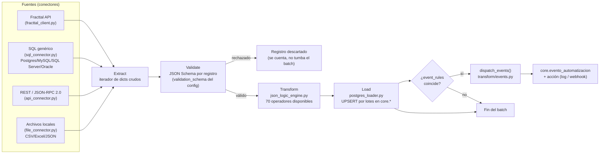

# Arquitectura del motor ETL — cmms-demo

Este documento describe el motor ETL genérico y configurable que corre
detrás del CMMS: cómo está organizado, cómo agregar una fuente de datos
nueva **sin escribir código**, y el catálogo completo de piezas
disponibles (conectores + operadores de transformación).

Inspirado en el manual de Fracttal One (226 pág.) — en particular en su
módulo **Automatizador** (pág. 202+), replicado acá como sistema de
eventos dinámico — pero generalizado para poder conectar **cualquier**
sistema empresarial, no solo Fracttal.

> Todo lo descrito acá corre **100% local y gratis** — sin servicios de
> nube pagos. Los ejemplos usan un MySQL local, un servidor JSON-RPC
> local, y una carpeta de archivos local, para poder demostrarse en
> vivo sin depender de credenciales de terceros.

## Índice
- [Vista general del flujo](#vista-general-del-flujo)
- [Mapeo Atomic Design](#mapeo-atomic-design)
- [Catálogo de conectores](#catálogo-de-conectores)
- [Catálogo de operadores de transformación](#catálogo-de-operadores-de-transformación)
- [Sistema de eventos (Automatizador)](#sistema-de-eventos-automatizador)
- [Validación automática de configs](#validación-automática-de-configs)
- [Cómo agregar una fuente nueva](#cómo-agregar-una-fuente-nueva-sin-código)
- [Módulos/DAGs actuales](#módulosdags-actuales)

## Vista general del flujo



Cada módulo (`transform/config/<modulo>.json`) declara: de dónde salen
los datos (a través del conector que use el DAG), cómo transformarlos
(`mapping`), a qué tabla van (`target_table`) y con qué llave de
conflicto (`conflict_key`), qué hace válido a un registro
(`validation_schema`, opcional), y qué reglas disparan eventos
(`event_rules`/`events`, opcional).

## Mapeo Atomic Design

La analogía completa (ya insinuada en el docstring original de
`dag_cmms_pipeline.py`, acá formalizada):

| Nivel | Qué es | Ejemplo |
|---|---|---|
| **Átomos** | Un operador de transformación o un conector individual — la pieza más chica, no se puede descomponer más | `{"trim": [...]}`, `SqlConnector`, `ApiConnector` |
| **Moléculas** | Un `mapping` completo — varios átomos combinados para transformar UN registro | El bloque `"mapping"` de `transform/config/activos.json` |
| **Organismos** | Un pipeline de módulo completo: extract → validate → transform → load → eventos | `_extract_transform_load()` en `dag_cmms_pipeline.py` |
| **Templates** | La función que genera N organismos a partir de un config — reutilizable, no depende de un módulo en particular | `build_dag()` / `build_dag_medidores()` |
| **Páginas** | Una instancia concreta corriendo — un DAG real, con su schedule, visible en la UI de Airflow | `cmms_activos`, `cmms_equipos_sede_externa`, `cmms_tareas_jsonrpc_demo` |

## Catálogo de conectores

Todos implementan la misma interfaz (`connectors/base.py`):
`extract(entity, updated_since=None) -> Iterator[dict]`.

| Conector | Archivo | Protocolo/motor | Config de ejemplo |
|---|---|---|---|
| Fracttal API | `connectors/fracttal_client.py` | REST + OAuth2 client_credentials | (usa variables de entorno `FRACTTAL_*`, no config JSON — es el conector original, específico) |
| SQL genérico | `connectors/sql_connector.py` | SQLAlchemy — Postgres, MySQL, SQL Server, Oracle (según driver instalado) | `connectors/config/sql_sources/erp_mysql_demo.json` |
| REST / JSON-RPC 2.0 | `connectors/api_connector.py` | REST plano o JSON-RPC 2.0 real (`{"jsonrpc":"2.0",...}`, batch, `result`/`error`) | `connectors/config/api_sources/mock_jsonrpc_demo.json` |
| Archivos locales | `connectors/file_connector.py` | CSV, Excel (.xlsx), JSON | `connectors/config/file_sources/import_local_demo.json` |

**Por qué no Google Sheets ni Azure todavía:** Google Sheets necesita
una cuenta de servicio de Google que aún no existe (queda para cuando
haya credenciales). Azure se reemplazó a propósito por el conector de
archivos locales — cubre el mismo caso de uso ("recibir exports de
otro sistema") sin depender de un servicio de nube pago.

### Ejemplo real funcionando: MySQL → Postgres

`connectors/mysql_demo_init/01_seed.sql` simula un ERP externo (MySQL,
la sede nueva de Arequipa) con una tabla `equipos_erp`. El DAG
`cmms_equipos_sede_externa` la lee con `SqlConnector` y la carga a
`core.activo` con el mismo `postgres_loader.py` que usan todos los
demás módulos — la prueba de que "cualquier fuente SQL" no es solo una
promesa de la documentación.

### Ejemplo real funcionando: JSON-RPC 2.0

`connectors/mock_jsonrpc_server/app.py` es un servidor JSON-RPC 2.0
real (spec completa: `result`/`error`, batch, notificaciones) corriendo
local. El DAG `cmms_tareas_jsonrpc_demo` le pide tareas de mantenimiento
con `ApiConnector` y las carga a `core.tarea`.

### Ejemplo real funcionando: archivo CSV local

`import/repuestos_nuevos.csv` — el DAG `cmms_repuestos_import_csv` lo
lee con `FileConnector` y actualiza `core.repuesto_almacen`. Para
"recibir" un archivo nuevo del ERP de otra área, basta con dejarlo en
`import/` — no hace falta tocar código.

## Catálogo de operadores de transformación

`transform/json_logic_engine.py` combina operadores **custom** propios
del proyecto con la librería estándar `json_logic` (json-logic-qubit) —
**33 operadores custom + 37 operadores estándar = 70 disponibles** en
cualquier `mapping` o `event_rules` de un config.

### Custom (33)

| Categoría | Operadores |
|---|---|
| Texto | `concat`, `trim`, `upper`, `lower`, `pad_left`, `pad_right`, `replace`, `regex_extract`, `regex_replace`, `slice` |
| Números | `round_to`, `clamp`, `to_number` |
| Fechas | `parse_date`, `date_diff_days`, `now`, `add_days`, `format_date`, `weekday_name` |
| Listas | `join`, `sum_list`, `distinct`, `first`, `last`, `count_list` |
| Rutas de ubicación | `split_path`, `path_level` |
| Utilidad | `default_if_null`, `map_lookup`, `coalesce`, `is_empty`, `to_string`, `to_bool` |

### Estándar (json-logic-qubit, 37)

`var`, `==`, `===`, `!=`, `!==`, `!`, `!!`, `<`, `<=`, `>`, `>=`, `?:`,
`and`, `or`, `if`, `+`, `-`, `*`, `/`, `%`, `in`, `cat`, `substr`, `max`,
`min`, `merge`, `log`, `count`, `map`, `filter`, `reduce`, `all`, `none`,
`some`, `missing`, `missing_some`, `method`

Tests de los operadores custom: `transform/tests/test_json_logic_engine.py`
(31 tests, corren sin necesitar Postgres — `python3 -m pytest transform/tests/ -v`).

## Sistema de eventos (Automatizador)

Cada config de módulo puede declarar `event_rules` (qué dispara un
evento, en JSON Logic) y `events` (qué acción tomar por cada evento).
`postgres_loader.load_module()` evalúa las reglas registro por
registro; `transform/events.py` (`dispatch_events()`) ejecuta la acción
configurada y deja rastro en `core.evento_automatizacion`.

```json
"event_rules": {"equipo_critico_nuevo": {"==": [{"var": "criticidad"}, "Muy Alta"]}},
"events":      {"equipo_critico_nuevo": {"action": "log"}}
```

Acciones disponibles hoy (registro extensible vía `@action("nombre")`
en `transform/events.py`):

| Acción | Qué hace |
|---|---|
| `log` (default) | Solo persiste el evento en `core.evento_automatizacion` |
| `webhook` | Además hace `POST` del evento como JSON a una URL (`"url"` o `"url_env_var"` en el config de la acción) |

Ver los eventos disparados: pestaña **Automatizador** en la webapp
(`/automatizador`, requiere sesión ADMIN/SUPERVISOR) — análoga al
módulo del mismo nombre en Fracttal.

## Validación automática de configs

`connectors/config_validator.py` valida contra JSON Schema **todos**
los configs (`connectors/config/{sql,api,file}_sources/*.json` y
`transform/config/*.json`) antes de que el stack termine de levantar —
corre como paso de `airflow-init` (ver `docker-compose.yml`). Un
config mal armado bloquea el arranque con un mensaje claro (archivo +
campo + qué está mal), en vez de que un DAG falle a medias en
producción.

```bash
# correrlo a mano:
docker compose exec airflow-scheduler python -m connectors.config_validator
```

## Cómo agregar una fuente nueva (sin código)

1. Elegí el conector según el tipo de fuente (SQL → `sql_connector`,
   API → `api_connector`, archivo → `file_connector`).
2. Creá un archivo en `connectors/config/{sql,api,file}_sources/tu_fuente.json`
   con la conexión/entidades (ver los `*_demo.json` existentes como
   plantilla).
3. Creá `transform/config/tu_modulo.json` con el `mapping` (qué
   operadores aplicar a cada campo), `target_table` y `conflict_key`.
4. Agregá una entrada a `MODULE_SCHEDULES` en
   `airflow/dags/dag_cmms_pipeline.py` y un `elif` en
   `_records_for_module()` que instancie tu conector — 3-4 líneas,
   siguiendo el patrón de `equipos_sede_externa`/`tareas_jsonrpc_demo`/
   `repuestos_import_csv`.
5. `docker compose exec airflow-scheduler airflow dags unpause cmms_tu_modulo`.

No hace falta tocar `postgres_loader.py`, `json_logic_engine.py`, ni
la webapp — el mismo motor sirve para cualquier fuente nueva.

## Módulos/DAGs actuales

| DAG | Fuente | Conector | Tabla destino | Frecuencia |
|---|---|---|---|---|
| `cmms_activos` | Fracttal/demo | `fracttal_client.py` | `core.activo` | Diaria |
| `cmms_ordenes_trabajo` | Fracttal/demo | `fracttal_client.py` | `core.orden_trabajo` | Cada 2h |
| `cmms_tareas` | Fracttal/demo | `fracttal_client.py` | `core.tarea` | Cada 2h |
| `cmms_medidores` | Fracttal/demo | `fracttal_client.py` | `core.medidor` + `core.lectura_medidor` | Cada 30 min |
| `cmms_almacenes` | Fracttal/demo | `fracttal_client.py` | `core.repuesto_almacen` | Diaria |
| `cmms_recursos_humanos` | Fracttal/demo | `fracttal_client.py` | `core.responsable` | Diaria |
| `cmms_repuestos_usados` | Fracttal/demo | `fracttal_client.py` | `core.ot_repuesto` | Cada 3h |
| `cmms_equipos_sede_externa` | ERP MySQL (demo) | `sql_connector.py` | `core.activo` | Cada 6h |
| `cmms_tareas_jsonrpc_demo` | Servidor JSON-RPC (demo) | `api_connector.py` | `core.tarea` | Cada 4h |
| `cmms_repuestos_import_csv` | Archivo local (demo) | `file_connector.py` | `core.repuesto_almacen` | Cada 12h |
